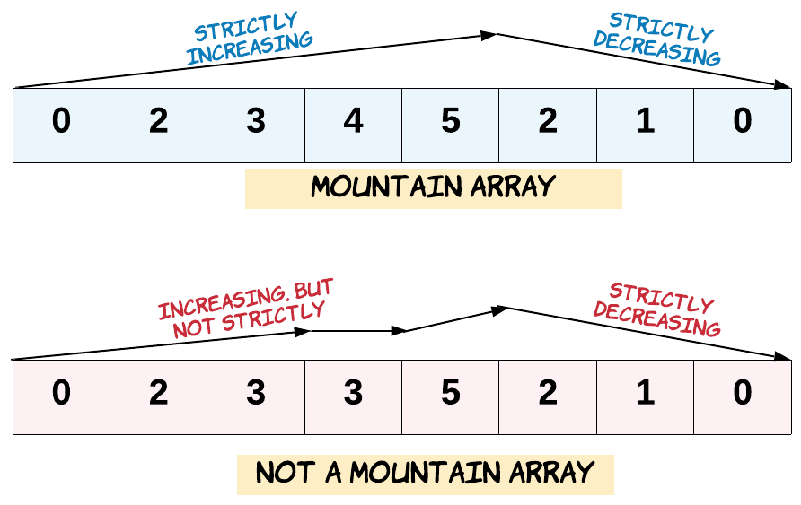

# 941. Корректный массив-гора

Дан массив целых чисел ```arr```.
Верните ```true``` тогда и только тогда,
когда он *является корректным массивом-горой*.

Напомним, что ```arr``` считается массивом-горой тогда,
когда выполняются следующие условия:

* ```arr.length >= 3```
* Существует индекс ```i```, такой что ```0 < i < arr.length - 1```,
и выполняются условия:
  * ```arr[0] < arr[1] < ... < arr[i - 1] < arr[i]```
  * ```arr[i] > arr[i + 1] > ... > arr[arr.length - 1]```


## Пример 1:
```
Ввод: arr = [2,1]
Вывод: false
```
## Пример 2:
```
Ввод: arr = [3,5,5]
Вывод: false
```
## Пример 3:
```
Ввод: arr = [0,3,2,1]
Вывод: true
```
## Ограничения:
```
1 <= arr.length <= 104
0 <= arr[i] <= 104
```


